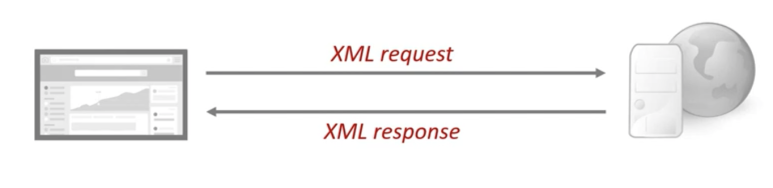
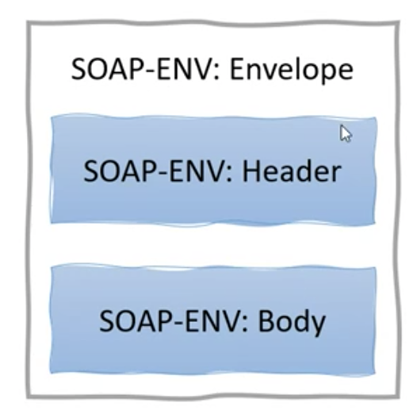
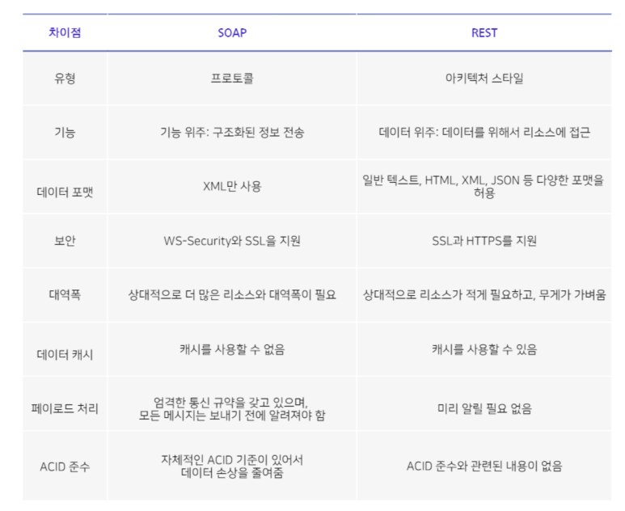

REST와 대비하여 자주 언급되는 SOAP이라는 개념이 있다. SOAP이란 무엇인가? Simple Object Access Protocol의 약자로서 http,https,smtp를 이용하여 XML메시지로 통신을 가능하게 해주는 프로토콜을 말한다. 아래 그림과 같이 XML로 request를 보내고 XML로 response를 받는다.


<br>
그리고 그 XML 메시지의 구조는 아래와 같이 Envelope, Header, Body의 세 부분(+Fault 부분 option)으로 이루어져 있다.
<br>


<br>

실제 SOAP의 메시지 구조를 살펴보면 아래와 같다. 전달하고자 하는 내용에 비해 부가적인 태그나 설정 관련 텍스트가 많아서 통신 시 불필요한 오버헤드가 발생할 뿐만 아니라 개발 하기에 까다롭기도 하다.

```html
<?xml version='1.0' Encoding='UTF-8' ?>
<env:Envelope xmlns:env="http://www.w3.org/2003/05/soap-envelope">
  <env:Header>
    <m:reservation
      xmlns:m="http://travelcompany.example.org/reservation"
      env:role="http://www.w3.org/2003/05/soap-envelope/role/next"
    >
      <m:dateAndTime>2007-11-29T13:20:00.000-05:00</m:dateAndTime>
    </m:reservation>
    <n:passenger
      xmlns:n="http://mycompany.example.com/employees"
      env:role="http://www.w3.org/2003/05/soap-envelope/role/next"
    >
      <n:name>Fred Bloggs</n:name>
    </n:passenger>
  </env:Header>
  <env:Body>
    <p:itinerary xmlns:p="http://travelcompany.example.org/reservation/travel">
      <p:departure>
        <p:departing>New York</p:departing>
        <p:arriving>Los Angeles</p:arriving>
      </p:departure>
      <p:return>
        <p:departing>Los Angeles</p:departing>
        <p:arriving>New York</p:arriving>
      </p:return>
    </p:itinerary>
  </env:Body>
</env:Envelope>
```

---

## SOAP vs REST

SOAP과 REST의 차이점을 아주 잘 보여주는 표가 있어서 가져와보았다. SOAP와 REST의 공통점이라고 한다면 HTTP,HTTPS를 통해 데이터를 통신한다는 점이지만 그 밖에 다른 부분들은 아래와 같이 많이 다르다.



> **여러가지 다른 점 중에서도 REST와 SOAP는 자주 비교되지만 그 개념 자체는 엄밀히 말하자면 다른 영역이라는 점이 눈에 띈다.**

- 즉, **REST는 통신 프로토콜이라기 보다 아키텍처 스타일 또는 가이드라인에 가깝고 SOAP는 프로토콜**이라는 것이다. 때문에 엄격히 구조화된 XML 데이터만 주고 받는 SOAP과는 다르게 REST는 여러가지 다양한 포맷의 데이터를 다양한 표현방식을 통해 유연한 통신이 가능하다.

* SOAP의 장점은 SOAP표준에 ACID 준수와 관련된 내용이 있어 SOAP은 자체적으로 ACID를 준수하여 데이터의 무결성을 지켜주고, 자체적으로 WS-Security라는 자체 보안 표준도 가지고 있어 은행권과 같은 민감한 데이터를 취급하는 애플리케이션에서 사용하기에 용이하다는 점이다.

  - 그러나 이와 같이 여러 표준과 형식에 구애 받기 때문에 앞서 말했듯이 SOAP은 REST에 비해 통신하는 데이터 형식에 있어서 자유롭지 못하고 불필요한 데이터를 통신하게 되는 경우가 많다.

* 따라서 일반적인 웹 서비스를 구현 할 떄는 REST가 주로 활용되고, 은행권과 같이 보안, 데이터 무결성 등이 중요한 기업용 애플리케이션에서는 SOAP이 활용되기도 한다.

---

참고자료 :

- https://blog.wishket.com/soap-api-vs-rest-api-%EB%91%90-%EB%B0%A9%EC%8B%9D%EC%9D%98-%EA%B0%80%EC%9E%A5-%ED%81%B0-%EC%B0%A8%EC%9D%B4%EC%A0%90%EC%9D%80/
- https://sabarada.tistory.com/30
